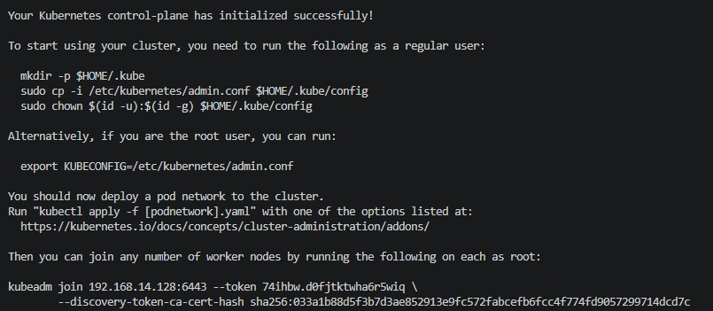
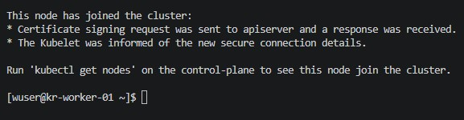
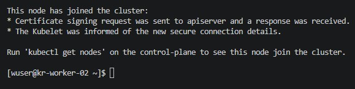
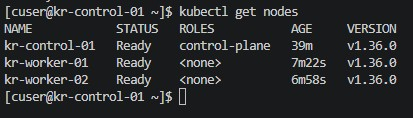
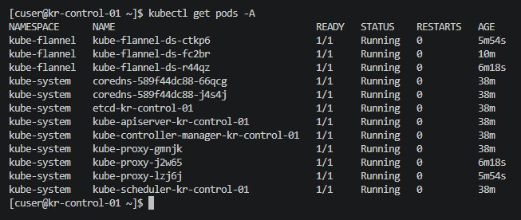

☸️ Kubernetes Cluster Initialization (Phase 2)

🎯 Objective

Initialize a multi-node Kubernetes cluster using kubeadm and configure pod networking across all nodes.

🖥️ Environment

Control Plane: kr-control-01 (192.168.14.128)

Worker Nodes:

kr-worker-01 (192.168.14.130)

kr-worker-02 (192.168.14.131)

OS: Rocky Linux

Container Runtime: containerd

Kubernetes Version: v1.36.0

🚀 Control Plane Initialization

Initialize Cluster

Executed on:

kr-control-01

Command used:

kubeadm init --pod-network-cidr=10.244.0.0/16

Why 10.244.0.0/16?

The VM network already uses:

192.168.14.0/24

Using a separate pod CIDR avoids:

IP overlap

Routing conflicts

Networking ambiguity

🔍 kubeadm Initialization Process

During initialization, kubeadm performed:

Preflight validation checks

Certificate generation

etcd setup

API Server deployment

Scheduler deployment

Controller Manager deployment

kubelet configuration

Bootstrap token generation

⚠️ Kernel Verification Warning

Observed warning:

kernel release 5.14.x is unsupported

Reason:

Rocky Linux uses a RHEL-based kernel

Kubernetes validates against upstream tested kernel versions

Although not explicitly listed, Rocky/RHEL kernels are widely used and compatible in enterprise environments

Cluster initialization completed successfully.

🔑 kubectl Configuration

Configured cluster access for non-root user.

Commands used:

mkdir -p $HOME/.kube

sudo cp -i /etc/kubernetes/admin.conf $HOME/.kube/config

sudo chown $(id -u):$(id -g) $HOME/.kube/config

Purpose:

Allows kubectl access without using root

Stores cluster configuration in user home directory

🌐 CNI Installation (Flannel)

Deploy Flannel Network Plugin

Command used:

kubectl apply -f https://raw.githubusercontent.com/flannel-io/flannel/master/Documentation/kube-flannel.yml

Why Flannel?

Selected for:

Simplicity

Lightweight setup

Easy troubleshooting

Good learning-focused CNI

🧠 Understanding CNI

Without a CNI plugin:

Pods cannot communicate

Nodes remain in NotReady state

Cross-node networking does not function

Flannel provides:

Pod-to-pod communication

Overlay networking

Pod IP allocation across nodes

🔗 Worker Node Join

Executed on:

kr-worker-01

kr-worker-02

Command used:

kubeadm join 192.168.14.128:6443 --token <token> \

--discovery-token-ca-cert-hash <hash>

Purpose:

Registers worker nodes with control plane

Enables workload scheduling across cluster

✅ Cluster Verification

Verify Nodes

kubectl get nodes

Result:

kr-control-01   Ready

kr-worker-01    Ready

kr-worker-02    Ready

Verify Cluster Pods

kubectl get pods -A

Verified components:

kube-apiserver

etcd

kube-controller-manager

kube-scheduler

kube-proxy

CoreDNS

Flannel

All components running successfully.

📸 Screenshots Captured

Control Plane Initialization

Worker Node Join (Worker 01)

Worker Node Join (Worker 02)

Cluster Nodes Ready

All Cluster Pods Running

🧠 Key Learnings So Far

Kubernetes control plane initialization workflow

Purpose of pod network CIDR

Difference between node network and pod network

Understanding CNI responsibilities

kubeadm bootstrap process

Worker node registration process

Kubernetes component architecture

Importance of overlay networking

🚧 Current Status

Multi-node Kubernetes cluster operational

All nodes in Ready state

Pod networking functional

Core Kubernetes components healthy

Cluster ready for workload deployment

🚀 Next Steps (Phase 3)

Deploy sample workloads

Create Services and expose applications

Test inter-pod communication

Explore Deployments and scaling

Implement ConfigMaps and Secrets

Introduce Calico and Network Policies later for advanced networking concepts

## 📸 Screenshots

### Control Plane Initialization

### Worker Node Join

### Worker Node Join

### Cluster Nodes Ready

### All Pods Running

